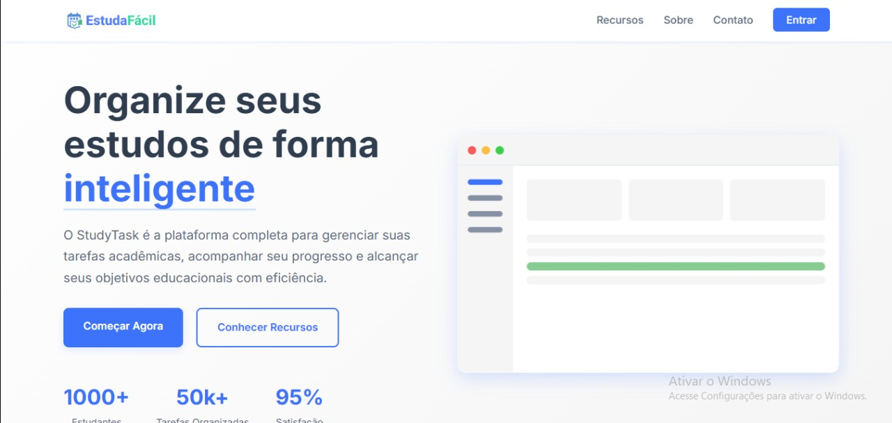

# 📌 Nome do Projeto

## 📖 Descrição do Projeto

EstudaFácil é um gerenciador de tarefas acadêmicas desenvolvido para ajudar estudantes a se organizarem melhor em sua rotina de estudos. O sistema possui uma interface simples em página única, com um planner semanal interativo onde os usuários podem adicionar, visualizar, editar e remover tarefas por dia da semana. Ideal para quem busca praticidade e foco na vida acadêmica.  
O principal objetivo do EstudaFácil é proporcionar aos estudantes uma forma simples, visual e eficiente de organizar suas tarefas acadêmicas, facilitando o planejamento semanal e incentivando a produtividade e o cumprimento de prazos.




---

## 🚀 Tecnologias Utilizadas

- HTML5  
- CSS3  
- JavaScript

---

## ⚙️ Instruções de Execução

1. Clone este repositório:
   ```bash
   git clone https://github.com/seu-usuario/EstudaFacil.git
   ```

2. Acesse a pasta do projeto:
   ```bash
   cd EstudaFacil
   ```

3. Execute o projeto localmente:
   - Abra o arquivo `index.html` no navegador  
   **ou**  
   - Use a extensão **Live Server** no VS Code para uma melhor experiência

---

## 👥 Créditos

Projeto desenvolvido por:

- Magno Cavalcanti
- Wesley Pablo
 
> Projeto acadêmico da disciplina de Autoria-Web – UNIFIP

